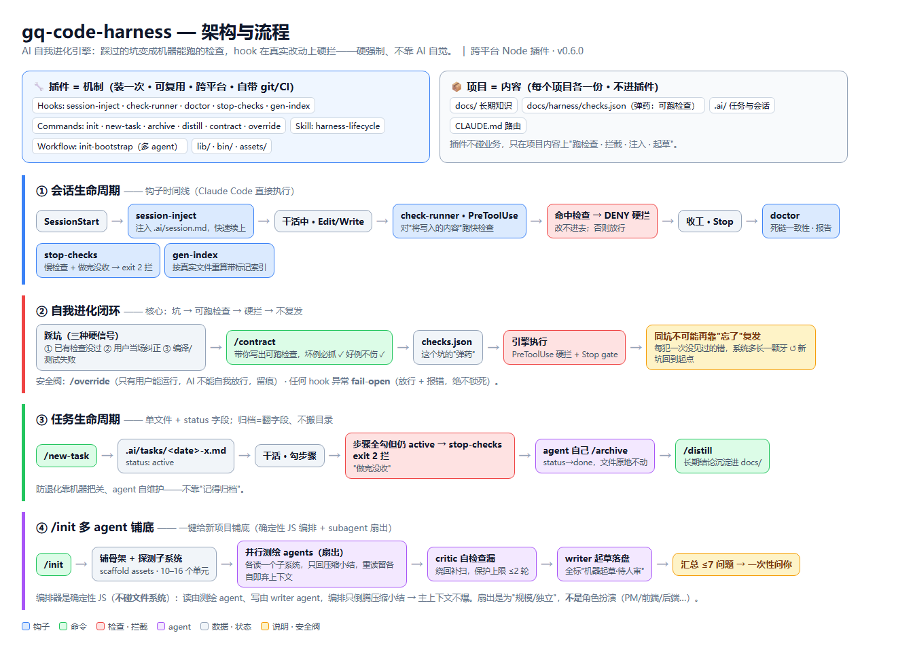

# gq-code-harness

gq-code-harness 是给 Claude Code 用的一套工程护栏。它把项目里踩过的坑写成能执行的检查，由 hook 在 AI 真正改文件时拦下违反——靠机器强制，不靠 AI 自己记得。

跨平台 Node 插件，无第三方依赖，当前 v0.6.0。



流程图另有 [PDF](docs/architecture.pdf) 和 [HTML 源](docs/architecture.html)。

## 它解决什么

三件原本只能靠"AI 记得"的事：

- 业务约束只是提示词，AI 可能没读、没遵守。这套把能判定的坑变成检查，写入时（PreToolUse）或收工时（Stop）一违反就拦。
- 任务记录会烂尾堆积。改成单文件任务加一个 `status` 字段，收工时机器自己挑出"做完没归档"的任务、驱动 AI 去归档。
- 新项目铺底全靠手写。`/init` 派多个 subagent 并行测绘代码库，起草初始文档，全标成待人审。

能写成检查的坑，一旦入库就不会再因为"AI 忘了"复发。判定不了的坑（比如看错需求）第一次仍要靠测试失败或你当场纠正——这点和人类团队一样，没有银弹，但同一个坑不会犯第二次。

## 机制和内容分开

插件只装一次、可复用、跨平台，里面是会跑检查、会拦的机器：hooks、命令、skill、铺底工作流。

每个项目自己留一份内容：`docs/` 知识、`docs/harness/checks.json` 检查、`.ai/` 任务、`CLAUDE.md` 路由。插件不碰业务，只在这些内容上跑检查、注入、起草。

## 安装

```
/plugin marketplace add noug12138/gq-code-harness
/plugin install gq-code-harness
```

装完重启 Claude Code 生效（hook 在会话开始时注册）。改了插件代码，用 `/plugin marketplace update` 加重启来刷新。

## Hooks

| Hook | 时机 | 做什么 |
| --- | --- | --- |
| session-inject | SessionStart | 把 `.ai/session.md` 注入会话开头，接上上次进度 |
| check-runner | PreToolUse | 对将写入的内容跑 checks.json，命中就拒绝这次写入（除非被 override） |
| doctor | Stop | 扫 docs/ 和 .ai/ 的 Markdown 死链，收工报告，不阻断 |
| stop-checks | Stop | 跑慢检查，再扫"做完没收"的任务，该拦的用 exit 2 挡住收工 |
| gen-index | Stop | 把带标记的 index.md 按真实文件重算目录 |

hook 自身出错一律放行并报错（fail-open），不会因为引擎自己的 bug 把人锁死。

## 命令

| 命令 | 做什么 |
| --- | --- |
| contract | 把一个坑写成检查；当场用坏例、好例各验一遍，过了才入库 |
| override | 临时放行一条被拦的检查。只有你能运行，AI 不能自己放行；留痕，下次触发消耗一次 |
| new-task | 在 .ai/tasks/ 起一个单文件任务 |
| archive | 归档任务，翻 status 字段、文件不挪；归档前先做沉淀扫描 |
| distill | 把任务里的长期结论提炼进 docs/ |
| init | 给项目铺底：骨架加多 agent 测绘起草 |

命令全名带 `gq-code-harness:` 前缀，例如 `/gq-code-harness:contract`。

## Skill

只有一个：`harness-lifecycle`，是单文件任务建、做、归档、沉淀的方法论。在 .ai/tasks/ 下干活、或被上面那三个任务命令调用时加载。

## 检查引擎

一条检查就是 checks.json 里的一段规则：

```json
{
  "id": "NO-NEW-OBJECTMAPPER",
  "globs": ["**/yudao-module-*/**/src/main/**/*.java"],
  "kind": "forbid",
  "pattern": "new ObjectMapper[(]",
  "reason": "业务代码用 JsonUtils，别 new ObjectMapper",
  "block": true
}
```

- kind：forbid 是命中即违反，require 是缺失即违反。
- block：写 true 时连收工的全仓扫描也拦，前提是现存违反基本为零，否则会把自己锁死；不写就只在写入时拦、收工只报。

加一条检查的路子是：踩到坑（已有检查没过、你纠正、或编译测试失败）→ 跑 contract 把它写成规则 → contract 当场验"坏例抓得住、好例不误伤"→ 过了入库。之后这个坑写入时就被挡，收工再兜一遍。

留了两个口子：override 让你临时放行（只有你能按、留痕），fail-open 保证引擎自己崩了也不锁人。

## 任务生命周期

一个任务就是一个文件：`.ai/tasks/YYYY-MM-DD-名字.md`，计划和过程写在一起。状态是文件头部的 `status` 字段（active / done / cancelled），归档就是把它翻成 done，文件不挪地方。

防烂尾不靠"记得归档"：收工时 stop-checks 扫一遍，看到某任务还是 active 但步骤已经全勾上了，就 exit 2 挡住收工、让 AI 自己去 archive，下次才放行。

## /init 多 agent 铺底

给新项目铺底，分两步。

第一步铺骨架，是确定性的、不用 agent：把 .ai/ 和 docs/ 的目录架子复制过去，已经存在的文件跳过。

第二步起草内容，用多个 subagent 扇出：

```
探测出 10–16 个子系统
  → 每个子系统派一个 agent 并行去读，只回一份压缩小结（读过的代码留在各自上下文里，不回传）
  → 一个 critic agent 查有没有漏、有没有像在猜，要补就绕回重扫，最多 2 轮
  → 一个 writer agent 把草稿写盘，全部标成「机器起草·待人审」
  → 把最多 7 个需要你确认的问题汇总，一次问你
```

几个设计取舍：

- 编排是一段确定性 JS，而且它不碰文件系统。读由测绘 agent 做，写由 writer agent 做，编排手里只有压缩小结，所以主对话的上下文不会被原始代码撑爆。
- 用 subagent 扇出，不用 agent team。测绘彼此独立、不用互相通信，省掉了丢消息的风险。
- 扇出是因为一个上下文装不下整个大仓，不是给 agent 分角色。这套没有常驻的"产品经理 / 前端 / 后端" agent——真正的专精是项目的路径规则和文档路由给的，不是人设。

没有 Workflow 运行时就退化成单 agent 顺序测绘；再不行就只铺骨架，内容你手填。

## 索引自动生成

想让某个 index.md 自动维护目录，就在里面圈一段标记，收工时 gen-index 按真实文件重算，标记外面手写的内容不动：

```markdown
<!-- gq-index:start kind=docs -->
（这中间自动生成）
<!-- gq-index:end -->
```

kind=docs 列同目录的文档，标题和说明从各文档的 frontmatter 读；kind=tasks 把任务按 status 分组。没加标记的 index.md 完全不碰，要不要自动维护你自己决定。/init 铺的新项目骨架自带标记。

## 项目这边放什么

```
项目根/
├─ docs/                      长期知识
│  └─ harness/checks.json     检查规则
├─ .ai/
│  ├─ session.md              会话状态，被 session-inject 注入
│  ├─ templates/task.md       任务模板
│  └─ tasks/                  当前任务
└─ CLAUDE.md                  路由总则
```

## 为什么全用 Node

hook 是 Claude Code 直接执行的，对机器上有没有对应运行时很敏感。PowerShell 偏 Windows，bash 在 Windows 得有 Git Bash 才行，只有 Node 是三个系统都有的那一个运行时（Claude Code 本来就依赖它）。所以 hook 全用 Node 写。

测试用 `npm test`（node:test，无依赖）。CI 在 .github/workflows/test.yml，每次 push 跑全部测试。

## 目录结构

```
gq-code-harness/
├─ .claude-plugin/            plugin.json / marketplace.json
├─ hooks/                     5 个 hook 加 hooks.json
├─ commands/                  6 个命令
├─ skills/harness-lifecycle/  生命周期方法论
├─ workflows/init-bootstrap.mjs   /init 的多 agent 工作流
├─ lib/                       纯逻辑
├─ bin/                       contract / scaffold 两个 CLI
├─ assets/                    /init 铺底用的骨架
├─ test/                      单测
└─ docs/architecture.*        这张架构图
```
